
# Summary
This is a summary of the work I have completed for the Donaldson Lab.

## Projects
1. [ UI Lab Capture ](#capt)
2. [ Automating Behavioral Scoring using Deep Lab Cut ](#dlc)
3. [ Vole Operant Quadrant Splitter ](#voqs)
4. [ Vole Surgery Registry ](#vreg)
5. [ Acknowledgements ](#ack)

## [UI Lab Capture](https://github.com/donaldsonlab/UI-lab-capture)
The goal was to create a simple GUI to interface with scientific instruments. The equipment being used included two Blackfly S cameras and a labjack U3-LV. The **UI Lab Capture** solves the problem of making mistakes while initializing different equipment for an experiment. I used multi-threading to help to organize the scheduling of tasks and multi-processing to relieve the stress caused by computatonally intensive tasks.The result was no missed frames which means data can be aligned properly and no post processing is needed to be done. This project taught me alot about outsourcing for help, project deadlines, and how to backtrack once you hit a dead end. 

  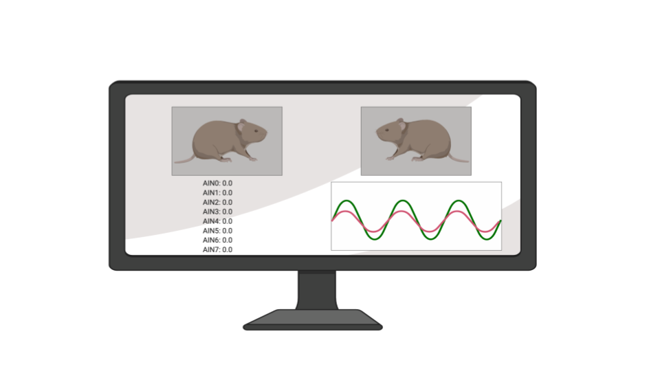

  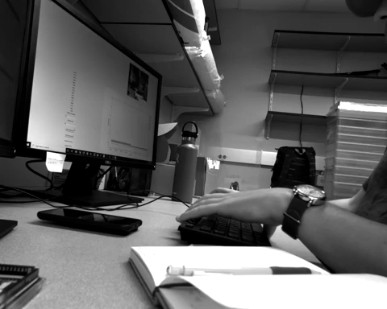

  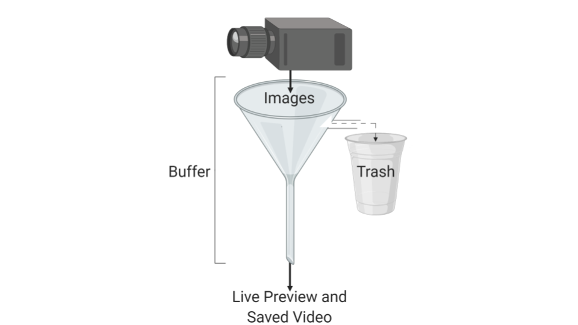

  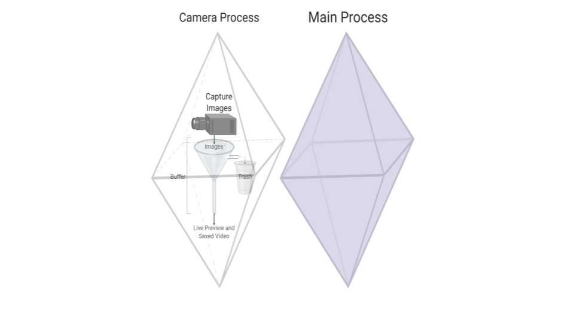

  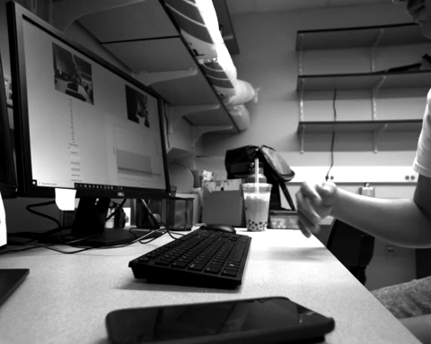

  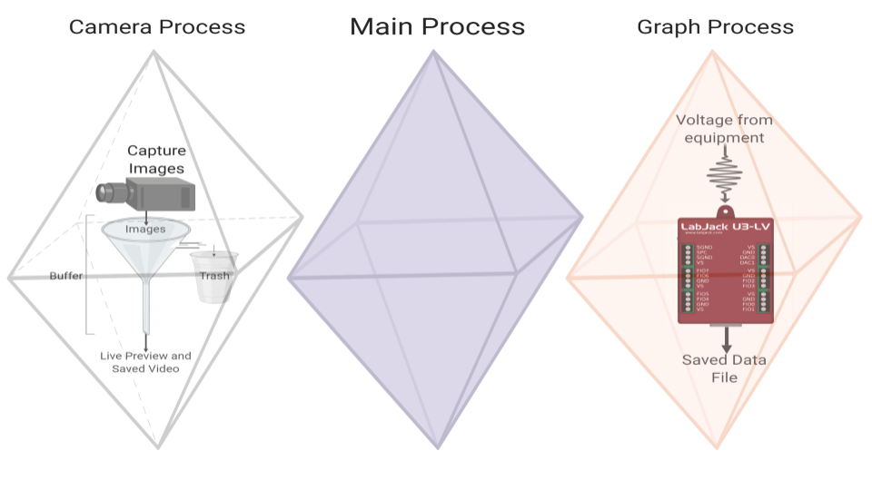

  

  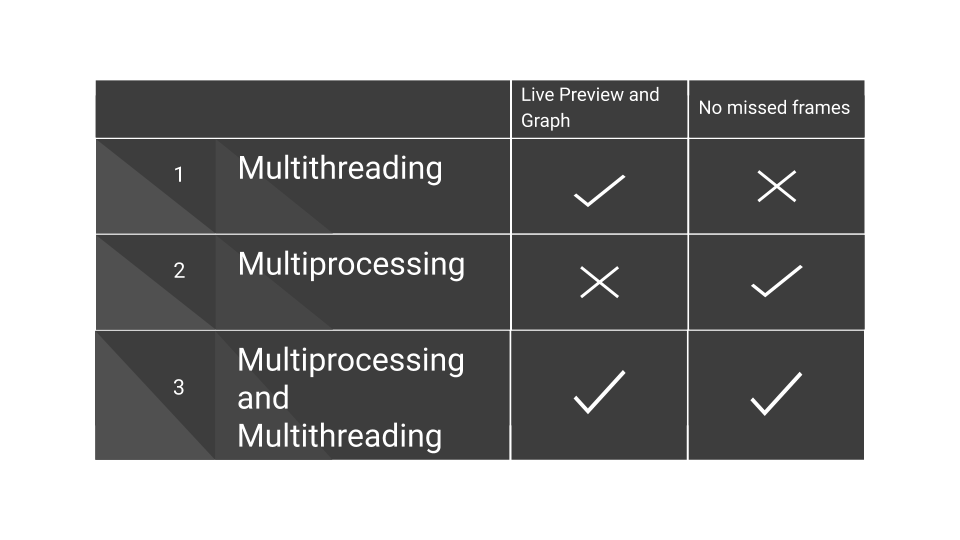

  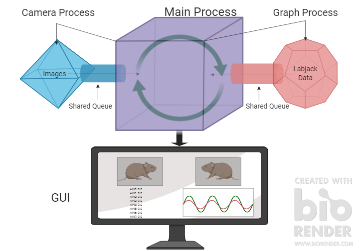

## [Automating Behavioral Scoring using Deep Lab Cut](https://github.com/donaldsonlab/DonaldsonDLC)
Currently there is lots of fantastic data, but someone has to manually watch and score each and every frame which can take hours. In adition we can only ask basic questions, like “Did they mate?”. Using markerless pose estimation, we can begin to analyze and quantify behavioral scoring in areas like mating bouts, partner preferences, and operant paradigms. The project uses a convolutional neural network to analyze videos which returns a labeled video, a csv formatted file of poses, and other metadata about the analyzed video. The csv file is then processed using a python script and graphed to show the covariation of movement between two voles. When complete, this project will save the lab hours of time which previously would have been used to hand mark each video.

  

  

  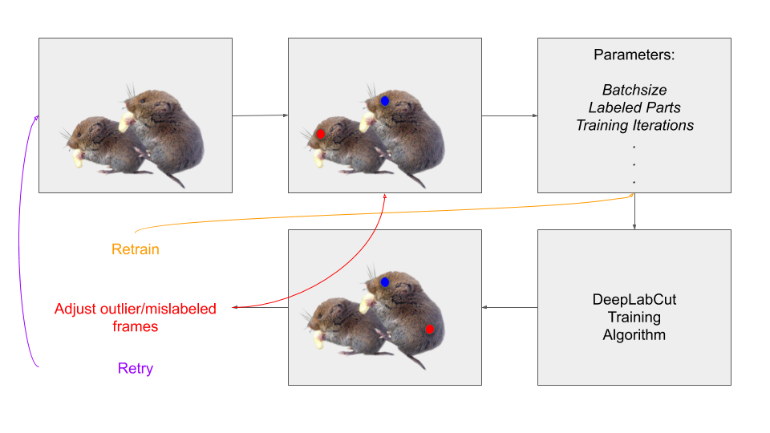

  

  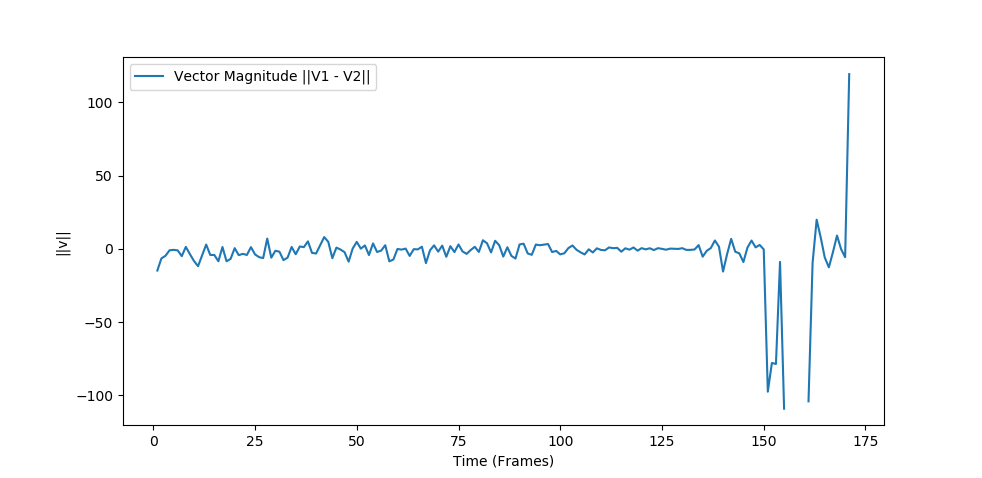

## [Vole Operant Quadrant Splitter](https://github.com/donaldsonlab/Documents/tree/master/Chase/Scripts/VoleOperantQuadrantSplitter)
The goal of this project was to create a GUI used for editing and cropping a video. For the lab's purposes, the video had 4 simultaneous vole operant experiments in a square-like pattern, or quadrants. For each of the quadrants, the user can enter as many voles as will fit on the GUI window. A vole has the following properties: a number, a starting time, an ending time. The GUI is hard coded for this specific use, but it can easily be adjusted by editing how the video is cropped in the import video function. To use effectively, the user should have the video up alongside the GUI.

  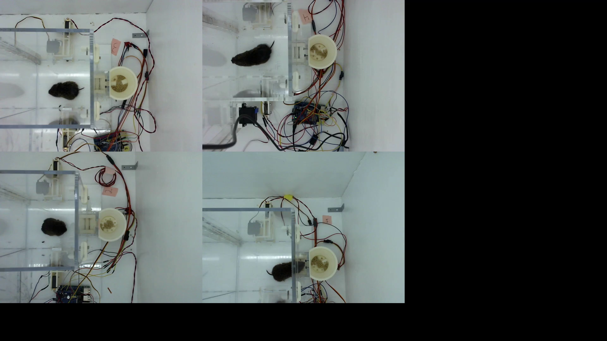

  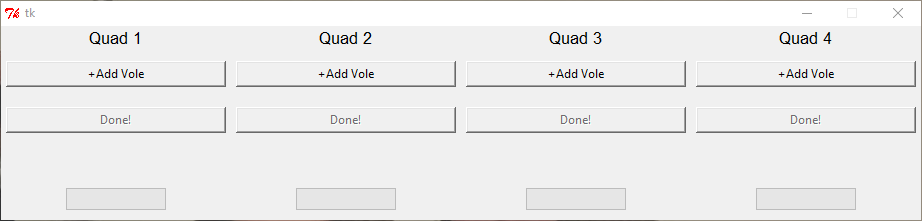

  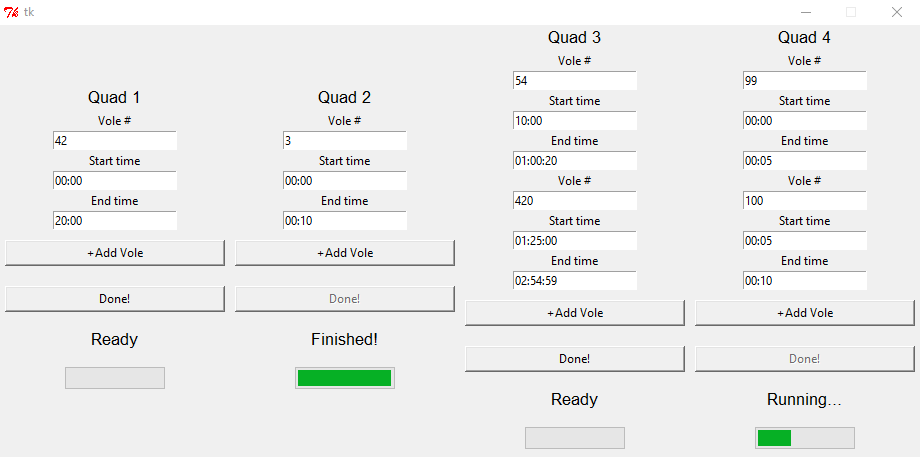

## [Vole Surgery Registry](https://github.com/donaldsonlab/vole_surgery_registry)
Previously completed by **Zach Nager**. This is a database created using Ruby on Rails to store information about surgeries preformed on voles. *Further details TBD*

## [Acknowledgements](https://dudas.io/)
* [ The Donaldson Lab ](http://www.zdonaldsonlab.com/)
  * Zoe Donaldson
  * David Protter
  * Everyone else!
* [ Nath, Mathis et al, 2019 ](http://www.mousemotorlab.org/deeplabcut)
* [ RC @ CU Boulder ](https://www.colorado.edu/rc/)

### [ To Top ](#top)
