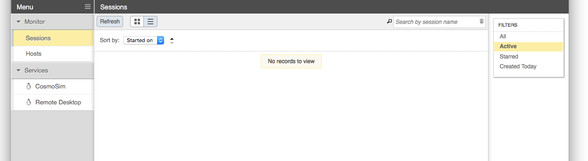

# Deep Lab Cut

## Research Core Given Instructions
### Login to your account on our Viz cluster (Enginframe)

### EnginFrame

NICE EnginFrame provides a 3d-accelerated remote desktop environment
on an Nvidia GPU-equipped compute node. Coupled with the proprietary
Desktop Cloud Visualization (DCV) VNC server, the EnginFrame service
supports the use of common visualization applications in a typical
desktop environment using only a modern web browser.


#### Accessing EnginFrame

Access to EnginFrame is granted on request. Request access by sending
email to rc-help@colorado.edu.

Once access has been granted, EnginFrame is available at
https://viz.rc.colorado.edu/.

From the welcome page, select "Views" from the available interfaces
(or use [this direct link][vdi]).

[vdi]: https://viz.rc.colorado.edu/enginframe/vdi/vdi.xml


Provide your RC login credentials at the login prompt. You will be
promted to use a second authentication factor (e.g., the Duo mobile
app) to log in.


#### Remote desktop

After logging in, select "Remote Desktop" from the list of services in
the left sidebar. (Other custom services may be configured for you as
well.)



When starting a Remote Desktop session you may customize the resources
allocated to the session and other characteristics of the dispatched
Slurm job. In most cases the defaults should be sufficient; however,
you may need to supply a Slurm account if you are associated with more
than one and you do not want to use your default account.


Once the session has started, a thumbnail of the running session
appears in the Sessions list. EnginFrame will attempt to open the
session automatically, but may be blocked by the browser. In that
case, simply select the session thumbnail from the list, or use the
"click here" link in the notification text.


With the Remote Desktop session running and open, you should be able
to run standard Linux desktop applications, including 3d-acellerated
OpenGL applications.


## Active Session

Once you have an active session, you'll be on a linux desktop that looks a lot like a Mac or Windows desktop. From the main menu, open a terminal. In the terminal, you can:

```
$ source /curc/sw/anaconda3/2019.03/bin/activate
$ conda activate DLCGPU_VIZ
```

...from this conda environment, you can proceed using deeplabcut in "ipython" as you normally would, and you should be able to get the GUI for the labeling step. See [Creating a project](#creating-a-project) to get started.

## DLC Instructions

### Creating a project
Using the same terminal from [Active Session](#active-session), we are going to start an Ipython environment importing deeplabcut:
```
ipython
import deeplabcut
```
Next, to create a new project use the following:
NOTE: Some parameters are not used or are optional when calling create_new_project
NOTE: config_path is set as a variable to easily assign config.yaml
```
config_path = deeplabcut.create_new_project(`Name of the project',`Name of the experimenter', [`Full path of video 1',`Full path of video2',`Full path of video3'], working_directory=`Full path of the working directory',copy_videos=True/False)
```

### Configure the project
Now is the time to edit the config.yaml file to your desire. See instructions on how and what [here](https://github.com/AlexEMG/DeepLabCut/blob/master/docs/functionDetails.md#b-configure-the-project)

### Label frames
To label the frames we first have to extract them using 

```
deeplabcut.extract_frames(config_path,‘automatic/manual’,‘uniform/kmeans’, userfeedback=False, crop=True/False)
```

Then to label the frames using a GUI type

```
deeplabcut.label_frames(config_path)
```

**Demo:** using the GUI to label a video from DeepLabCut[http://www.mousemotorlab.org/deeplabcut]

<p align="center">

</p>

Help for [extracting frames](https://github.com/AlexEMG/DeepLabCut/blob/master/docs/functionDetails.md#c-data-selection) or [labeling frames](https://github.com/AlexEMG/DeepLabCut/blob/master/docs/functionDetails.md#d-label-frames) 


### Check Annotated Frames:

```
deeplabcut.check_labels(config_path)
```

more details [here](https://github.com/AlexEMG/DeepLabCut/blob/master/docs/functionDetails.md#e-check-annotated-frames)

### Create Training Dataset:

```
deeplabcut.create_training_dataset(config_path,num_shuffles=1)
```

more details [here](https://github.com/AlexEMG/DeepLabCut/blob/master/docs/functionDetails.md#f-create-training-dataset)

### Train The Network:

```
deeplabcut.train_network(config_path,shuffle=1)
```

more details [here](https://github.com/AlexEMG/DeepLabCut/blob/master/docs/functionDetails.md#g-train-the-network)

### Evaluate the Trained Network:

```
deeplabcut.evaluate_network(config_path,shuffle=[1], plotting=True)
```

more details [here](https://github.com/AlexEMG/DeepLabCut/blob/master/docs/functionDetails.md#h-evaluate-the-trained-network)

### Video Analysis and Plotting Results:
NOTE: **novel videos DO NOT need to be added to the config.yaml file**. You can simply have a folder elsewhere on your computer and pass the video folder (then it will analyze all videos of the specified type (i.e. ``videotype='.mp4'``), or pass the path to the **folder** or exact video(s) you wish to analyze:

```
deeplabcut.analyze_videos(config_path,[`/fullpath/project/videos/'], videotype='.mp4', save_as_csv=True)
```
Here are some tips for scaling up your analysis using [batch analysis](https://github.com/AlexEMG/DeepLabCut/wiki/Batch-Processing-your-Analysis)

You can also filter the predicted bodyparts by:
```
deeplabcut.filterpredictions(config_path,[`/fullpath/project/videos/reachingvideo1.avi'], shuffle=1)
```
NOTE: This creates a file with the ending filtered.h5 that you can use for further analysis. This filtering step has many parameters, so please see the full docstring by typing: ``deeplabcut.filterpredictions?``

##### Create videos:
```
deeplabcut.create_labeled_video(config_path,[`/analysis/project/videos/reachingvideo1.avi',`/fullpath/project/videos/reachingvideo2.avi'],filtered=True)
```

##### Plot the outputs:
```
deeplabcut.plot_trajectories(config_path,[`/fullpath/project/videos/reachingvideo1.avi'],filtered=True)
```

more details [here](https://github.com/AlexEMG/DeepLabCut/blob/master/docs/functionDetails.md#i-video-analysis-and-plotting-results)


### [Optional] Active Learning --> Network Refinement
##### Extract outlier frames from a video:

```
deeplabcut.extract_outlier_frames(config_path,[`videofile_path'])
```

more details [here](https://github.com/AlexEMG/DeepLabCut/blob/master/docs/functionDetails.md#j-refinement-extract-outlier-frames)

##### Refinement of the labels with our GUI:
(refinement and augmentation of the training dataset)

```
deeplabcut.refine_labels(config_path)
```

**mini-demo:** using the refinement GUI, a user can load the file then zoom, pan, and edit and/or remove points:

<p align="center">

</p>

When done editing the labels, merge:

```
deeplabcut.merge_datasets(config_path)
```
Now, create a new training set and re-train (same steps as above)!

more details [here](https://github.com/AlexEMG/DeepLabCut/blob/master/docs/functionDetails.md#k-refine-labels-augmentation-of-the-training-dataset)


### Additional Resources

- [https://www.nice-software.com/products/enginframe](https://www.nice-software.com/products/enginframe)
- [https://www.nice-software.com/products/dcv](https://www.nice-software.com/products/dcv)

### Credit 
* RC - CU Boulder
* Andrew Monaghan
